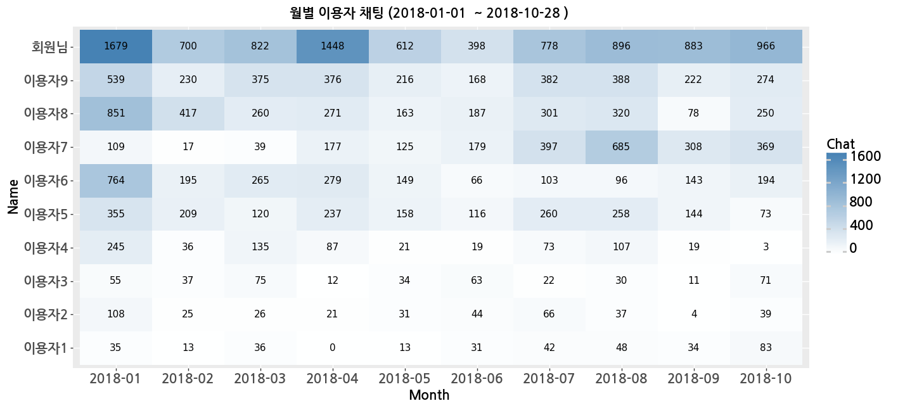
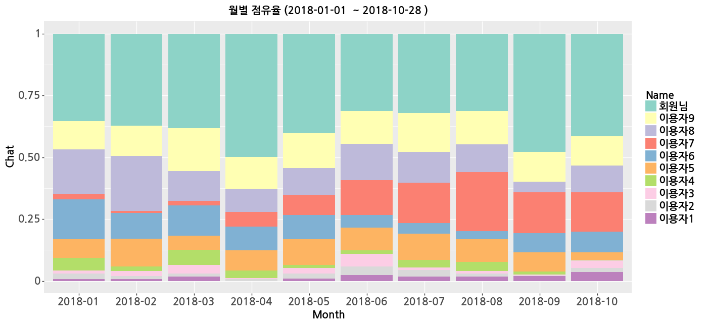
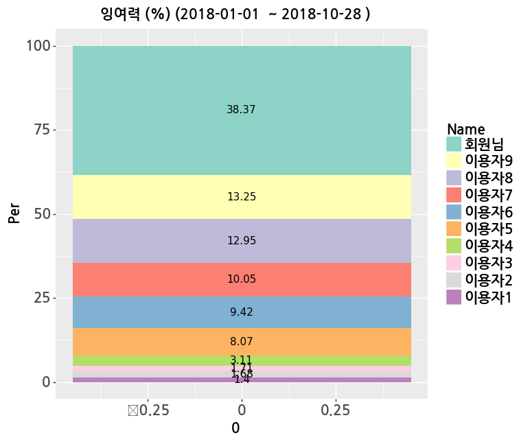
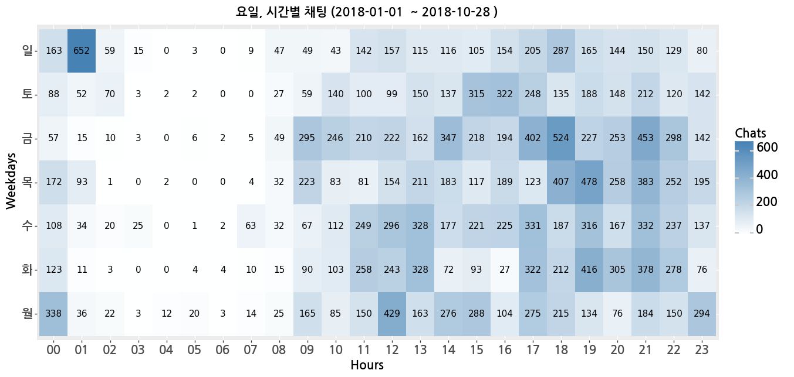
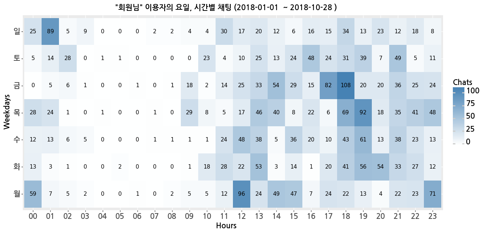

# KAKAO TEXT ANALYSIS - 카카오톡 대화 분석

## 1. 개요
카카오톡 대화 내용을 입력받아 각 유저마다 요일별, 시간별, 월별 대화 횟수 및 빈도를 차트로 출력하는 python3 패키지 입니다.  
대화 내용이 담겨 있는 텍스트파일이 필요하며, 모바일 버전과 PC버전 어느것을 사용해도 무방합니다.

* 다음 라이브러리 설치가 요구됩니다.
~~~
pip install pandas #dataframe 가공 및 편집
pip install plotnine #그래픽 출력
~~~
  pandas : <https://pandas.pydata.org>  
  plotnine : <https://plotnine.readthedocs.io/en/stable/>

## 2. 예제
### 2.1 패키지 및 텍스트 파일 불러오기
먼저 패키지를 실행하고, 카카오톡 대화 내용이 담긴 텍스트 파일을 불러옵니다.
~~~python
### 패키지 실행
from kakao_text_analysis import *

### 텍스트파일 불러오기
f = open('/home/user/KakaoTalkChats.txt', 'r', encoding='utf-8-sig')
Text = f.readlines()
~~~
텍스트 파일은 다음과 같이 한 줄 마다 읽어서 저장됩니다.
```
['단톡방 10 카카오톡 대화\n',
 '저장한 날짜 : 2018년 10월 28일 오후 6:52\n',
'\n',
'\n',
'2017년 4월 15일 오후 9:11\n',
'2017년 4월 15일 오후 9:11, 초롱초롱 무지님이 하트뿅뿅 라이언님을 초대했습니다.\n',
'2017년 4월 15일 오후 9:12, 초롱초롱 무지 : .\n',
'2017년 4월 15일 오후 9:17, 귀여운 프로도 : 배고프다\n',
'2017년 4월 15일 오후 9:17, 귀여운 프로도 : 맘터가실분?\n',
...]
```

### 2.2 텍스트 파일 가공
패키지에 포함된 KakaoAnal을 불러와서 다음 코드를 실행합니다.  
텍스트파일을 벡터 형태로 변환하는 작업입니다.
~~~python
kakao = KakaoAnal(Text)
~~~
실행시키면 아래와 같은 문장이 나오는데, 분석을 시작할 날짜를 입력합니다.
~~~ 
[시작할 날짜를 입력해주십시오. (ex. 2018-01-01)]  
~~~


### 2.3 차트 출력
* 월별 이용자 채팅
~~~python
kakao.chart_count_by_month()
~~~


* 월별 이용자 점유율
~~~python
kakao.chart_count_by_month_rate()
~~~


* 전체기간 이용자 점유율
~~~python
kakao.chart_pie()
~~~


* 요일 시간별 채팅
~~~python
kakao.chart_count_by_weekdays()
~~~


* 해당 이용자의 요일 시간별 채팅
~~~python
kakao.chart_count_by_weekdays_by_user()
~~~

