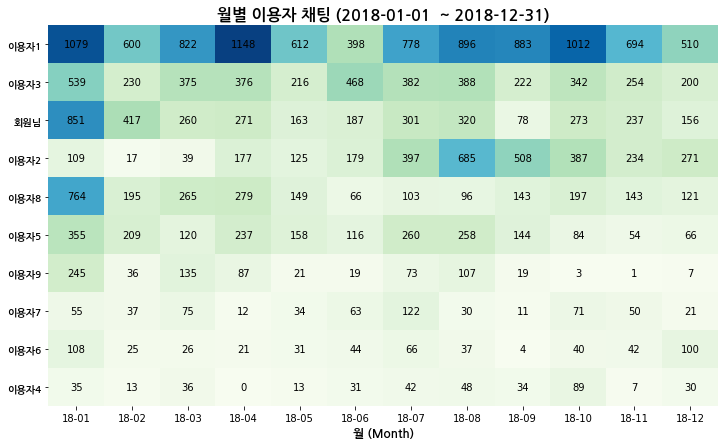

# KAKAO TEXT ANALYSIS - 카카오톡 대화 분석 (by Python3)

## 1. 개요
카카오톡 대화 내용을 입력받아 각 유저마다 요일별, 시간별, 월별 대화 횟수 및 빈도를 차트로 출력하는 python3 모듈 입니다.  
대화 내용이 담겨 있는 텍스트 파일이 필요하며, 모바일 버전과 PC버전 어느것을 사용해도 무방합니다.

* 다음 라이브러리 설치가 요구됩니다.
~~~
apt-get install python3-matplotlib # 그래프 출력
apt-get install python-tk # UI 관련
~~~
  matplotlib : <https://matplotlib.org>  
  tkinter : <https://tkdocs.com/index.html>

## 2. 실행
### 2.1 패키지 및 텍스트 파일 불러오기
먼저 메인 프로그램을 실행합니다.
~~~
python3 main.py
~~~

위와 같은 창이 뜨면 카카오톡 대화 내용이 담긴 텍스트 파일의 경로를 입력합니다.  

경로는 운영체제에 따라 형식이 다를 수 있습니다.  
ex)  
Linux : /home/minjae/다운로드/KakaoTalkChats.txt  
Window : C:\\\\Users\\\\Minjae\\\\Downloads\\\\KakaoTalkChats.txt  

위와 같이 성공적으로 불러왔다는 메세지가 뜨면 정상적으로 텍스트 파일을 불러온 것입니다.

그 후 분석을 시작할 날짜를 입력합니다.

형식은 yyyy-mm-dd 의 형식으로 입력해야 합니다.  
yyyy-mm 까지만 입력하면 해당 월의 첫 날 부터 분석을 시작하며, 마찬가지로 연도만 입력하면 해당 연도의 맨 처음부터 분석을 시작하게 됩니다.

### 2.2 차트 출력
* 종합 분석

* 월별 이용자 채팅

* 월별 이용자 점유율

* 전체기간 이용자 점유율

* 요일 시간별 채팅

